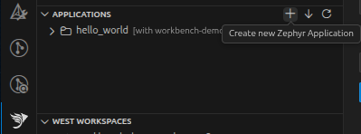
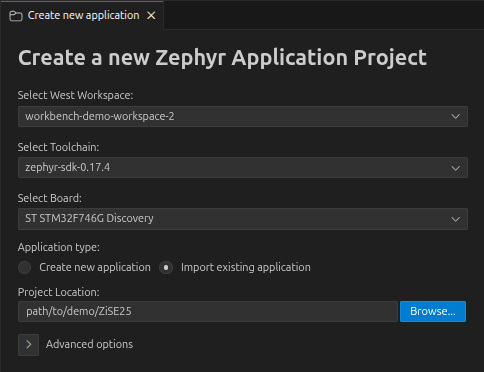
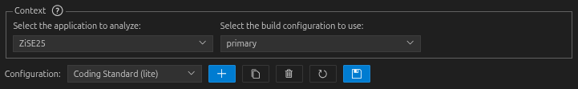
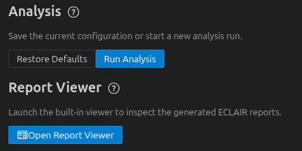

# Zephyr Workbench ECLAIR Manager Demo

This repository contains some example configurations to demonstrate the use of the ECLAIR Manager panel in the Zephyr Workbench extension for Visual Studio Code.

> [!IMPORTANT]
> 🚧 This repository is a WIP.

## Getting Started

### Initialize the workspace

Clone the repository and initialize the workspace using west:
```bash
mkdir new-workspace
cd new-workspace
west init -m https://github.com/BUGSENG/zephyr-workbench-eclair-demo --mr main
west update
```

Then initialize the submodules:
```bash
cd demo
git submodule update --init --recursive
```

### Importing the workspace into the Zephyr Workbench extension

From Visual Studio Code, open the Code Workspace: [`demo.code-workspace`](./demo.code-workspace).

Then, import the Zephyr workspace:

TODO ...

Then, from the "Applications" panel, import each project individually using the "Create new Zephyr Application" button:



This will open a the panel where you can import each example project individually:



### Using the ECLAIR Manager panel

Open the ECLAIR Manager form the Command Palette (<kbd>Ctrl+Shift+P</kbd>).

Select a project and a configuration, for example by selection the ZiSE25 application:



You can then run the analysis and view the result:


